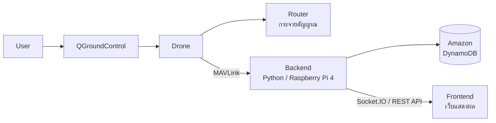

# Final-Drone 🚁

**ระบบ SOS สำหรับโดรนกระจายสัญญาณ (Signal Relay Drone)**

โปรเจกต์ทำโดรนกระจายสัญญาณอินเทอร์เน็ตในพื้นที่อับสัญญาณหรือสัญญาณน้อย
พร้อมระบบเฝ้าดูและแจ้งเตือน **SOS** ให้รู้สถานะการทำงานของโดรนแบบ real-time
เช่น แบตเตอรี่ ใบพัด อุณหภูมิ และสถานะ Router ที่ใช้กระจายสัญญาณ

---

## ภาพรวมระบบ



| ส่วน | หน้าที่ |
|---|---|
| **QGroundControl** | แอปควบคุมโดรน ส่งต่อข้อมูลโดรน (MAVLink) ให้ Backend |
| **Backend** | เก็บข้อมูลการทำงานของโดรน, ค่าจาก Sensor, สถานะ Router และตรวจระบบ SOS |
| **Database** | เก็บข้อมูลย้อนหลังและประวัติการแจ้งเตือนบน Amazon DynamoDB |
| **Frontend** | แสดงค่าสถานะต่างๆ และแจ้งเตือน SOS บนเว็บ |

---

## ระบบ SOS

ระดับการแจ้งเตือน: `NORMAL` → `WARNING` → `CRITICAL` → `SOS`

| หมวด | ตรวจอะไร |
| แบตเตอรี่ | ≤ 30% WARNING, ≤ 20% CRITICAL, ≤ 10% SOS |
| ใบพัด / มอเตอร์ | ใบพัดไม่หมุน (SOS), ทำงานไม่สมดุล (CRITICAL) |
| อุณหภูมิ | มอเตอร์, แบตเตอรี่, บอร์ดควบคุม, Raspberry Pi, Router |
| Router | Router กระจายสัญญาณไม่ทำงาน |
| การเชื่อมต่อ | ขาดการเชื่อมต่อกับโดรน (SOS), สัญญาณควบคุมอ่อน |
| การบิน | ร่วงเร็วผิดปกติ, Autopilot แจ้งเตือน, เซนเซอร์เสีย, GPS ไม่พอ |

เกณฑ์ทั้งหมดปรับได้ใน `Backend/config.py` หรือไฟล์ `.env`

---

## ความคืบหน้า

| ไฟล์ | หน้าที่ | สถานะ |
|---|---|---|
| `Backend/config.py` | ค่าตั้งค่าและเกณฑ์ SOS | ✅ เสร็จ |
| `Backend/alerts.py` | ระบบ SOS | ✅ เสร็จ |
| `Backend/telemetry.py` | รับค่าจากโดรนผ่าน QGroundControl (MAVLink) | ⏳ รอทำ |
| `Backend/simulator.py` | โดรนจำลองสำหรับทดสอบ | ⏳ รอทำ |
| `Backend/storage.py` | บันทึกข้อมูลลง Amazon DynamoDB | ⏳ รอทำ |
| `Backend/setup_aws.py` | สร้างตาราง DynamoDB | ⏳ รอทำ |
| `Backend/app.py` | ตัวหลักของ Backend + API ให้ Frontend | ⏳ รอทำ |
| `Backend/console.py` | แสดงผลแบบ real-time ใน Terminal | ⏳ รอทำ |
| Frontend | เว็บแสดงผลและแจ้งเตือน SOS | ⏳ รอทำ |

---

## วิธีทดสอบ

ต้องมี Python 3.10 ขึ้นไป

```bash
git clone https://github.com/parisakhao-hash/Final-Drone.git
cd Final-Drone/Backend
python3 alerts.py
```

ผลที่ได้: ระบบ SOS ตรวจค่าตัวอย่าง เช่น แบตต่ำ, ใบพัดไม่หมุน, อุณหภูมิเกิน, Router ดับ, ขาดการเชื่อมต่อ

```
[NORMAL  ] ปกติ
[CRITICAL] แบตต่ำ
           - battery: แบตเตอรี่ต่ำ 18%
[SOS     ] ใบพัด M3 ไม่หมุน
           - propeller: ใบพัด/มอเตอร์ M3 ไม่หมุน
[CRITICAL] Router ดับ
           - router: Router กระจายสัญญาณไม่ทำงาน
[SOS     ] ขาดการเชื่อมต่อ
           - connection: ขาดการเชื่อมต่อกับโดรน
```

---

## เทคโนโลยีที่ใช้

| ด้าน | เทคโนโลยี |
| ภาษา | Python |
| ควบคุมโดรน | QGroundControl, ArduPilot / PX4 |
| สื่อสารกับโดรน | MAVLink (pymavlink) |
| ฮาร์ดแวร์ | Raspberry Pi 4 |
| ฐานข้อมูล | Amazon DynamoDB (boto3) |
| ส่งข้อมูลให้เว็บ | Flask-SocketIO, REST API |


## แหล่งอ้างอิง

### โดรนและการสื่อสาร (MAVLink)

| โปรเจกต์ | ใช้ทำอะไร |
|---|---|
| [QGroundControl](https://github.com/mavlink/qgroundcontrol) | แอปควบคุมโดรน และส่งต่อข้อมูล MAVLink ให้ Backend |
| [MAVLink](https://github.com/mavlink/mavlink) | โปรโตคอลสื่อสารระหว่างโดรนกับภาคพื้น |
| [pymavlink](https://github.com/ArduPilot/pymavlink) | ไลบรารี Python สำหรับอ่านข้อมูล MAVLink |
| [ArduPilot](https://github.com/ArduPilot/ardupilot) | เฟิร์มแวร์ flight controller |
| [PX4 Autopilot](https://github.com/PX4/PX4-Autopilot) | เฟิร์มแวร์ flight controller (อีกตัวเลือก) |
| [mavlink-router](https://github.com/mavlink-router/mavlink-router) | แบ่งสัญญาณ MAVLink ไปหลายปลายทาง (ใช้บน Raspberry Pi) |
| [MAVSDK-Python](https://github.com/mavlink/MAVSDK-Python) | ไลบรารี Python ระดับสูงสำหรับควบคุมโดรน (ศึกษาเพิ่มเติม) |
| [pyserial](https://github.com/pyserial/pyserial) | เชื่อมต่อ flight controller ผ่านสาย UART / USB |

### Backend, Database และเว็บ

| โปรเจกต์ | ใช้ทำอะไร |
|---|---|
| [Flask-SocketIO](https://github.com/miguelgrinberg/Flask-SocketIO) | ส่งข้อมูล real-time จาก Backend ไป Frontend |
| [Socket.IO](https://github.com/socketio/socket.io) | ฝั่ง Frontend ใช้รับข้อมูล real-time |
| [boto3](https://github.com/boto/boto3) | AWS SDK สำหรับ Python ใช้เชื่อม Amazon DynamoDB |
| [moto](https://github.com/getmoto/moto) | จำลอง AWS ในเครื่อง ใช้ทดสอบโดยไม่ต้องมีบัญชี AWS |
| [python-dotenv](https://github.com/theskumar/python-dotenv) | อ่านค่าตั้งค่าจากไฟล์ `.env` |

### เอกสาร

| เอกสาร | เนื้อหา |
|---|---|
| [MAVLink Common Messages](https://mavlink.io/en/messages/common.html) | รายการข้อความ MAVLink ทั้งหมด (แบต, GPS, มอเตอร์ ฯลฯ) |
| [QGroundControl User Guide](https://docs.qgroundcontrol.com/master/en/qgc-user-guide/) | คู่มือการใช้งาน QGroundControl |
| [ArduPilot: Raspberry Pi via MAVLink](https://ardupilot.org/dev/docs/raspberry-pi-via-mavlink.html) | การต่อ Raspberry Pi กับ flight controller |
| [Amazon DynamoDB Developer Guide](https://docs.aws.amazon.com/amazondynamodb/latest/developerguide/Introduction.html) | คู่มือการใช้งาน DynamoDB |

---

## ผู้จัดทำ


